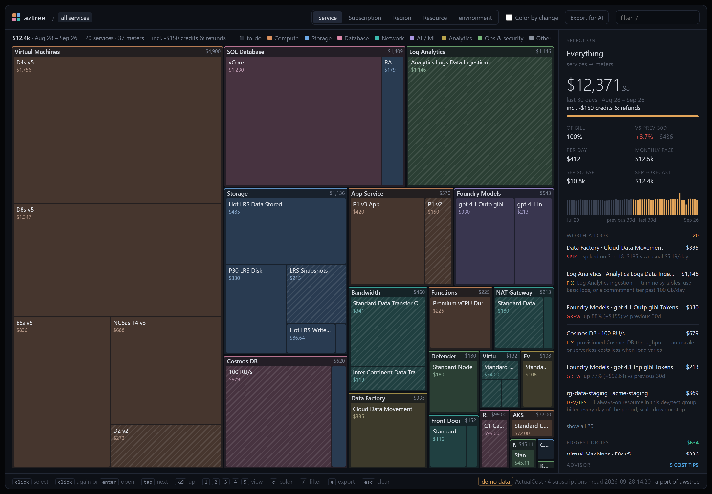

# aztree

**Where did my Azure money go?** aztree reads your Azure costs and draws them as a treemap: big box, big cost. It's a port of [awstree](https://github.com/petricbranko/awstree) by Branko Petric, which took the idea from [disktree](https://x.com/tobi/status/2103251521223921739) by [Tobi Lütke](https://x.com/tobi). Same idea again, pointed at an Azure subscription.



It's one Python file with no dependencies to install, and it produces a single HTML page that works offline.

## Quick start

```bash
git clone https://github.com/milanm/aztree && cd aztree
python3 aztree.py --demo                    # try it with fake data, no Azure needed
az login
python3 aztree.py                           # your current subscription
python3 aztree.py --all                     # every subscription you can see
```

The page opens in your browser. It shows the last 30 days, compared with the 30 days before.

## What you get

- **Treemap** of spend by service → meter. Press `2` to group by subscription, `3` by region and `4` by resource group → resource.
- **Color by change** (`c`): red where spend grew, green where it shrank.
- **Selection panel:** cost, share of the bill, change vs the previous period, monthly pace and a daily chart.
- **Worth a look:** the fastest-growing costs plus common Azure money pits: Log Analytics ingestion, data transfer out, NAT and Firewall data processing, Basic and idle public IPs, disk snapshots, previous-generation VM sizes, Premium v2 App Service plans and Extended Security Updates.
- **Advisor:** Azure Advisor's cost recommendations (reservations, savings plans, right-sizing), one per resource and SKU. Click one to jump to the resource or subscription it's about.
- **Export for AI:** a JSON summary to hand to any AI agent (see below).

Click to select, double-click to zoom in, `⌫` to go back up, `/` to filter. Add `#resource`, `#subscription` or `#region` to the page's URL to open that view.

## Requirements

- Python 3.8+ and the [Azure CLI](https://aka.ms/azcli), logged in with `az login`. No CLI? Put a token for `https://management.azure.com/` in `AZURE_ACCESS_TOKEN` and name the subscriptions with `--subscription` or `--all`. A bare token only sees its own tenant; through the CLI, aztree sees every tenant you're logged in to and gets a token for each.
- The **Cost Management Reader** role (or Reader) on each subscription. Advisor tips need Reader; without it you still get the page.
- Tested on a CSP subscription. Pay-as-you-go and Visual Studio subscriptions use the same API. EA and MCA billing scopes should work through `--scope`, but nobody has tried yet. At such a scope the subscription view shows the whole scope as one box, and Advisor is skipped.

**Cost:** Cost Management queries are free. Azure throttles them per subscription, so a run makes about 7–10 requests per subscription and may wait 30–60 seconds when Azure asks it to. aztree saves the data, so reopening the page is instant:

```bash
python3 aztree.py --from out/aztree-data.json
```

## Ask an AI about your bill

```bash
python3 aztree.py --from out/aztree-data.json --export
```

This writes `out/aztree-export.json`, a compact summary that includes instructions for the agent. It has totals; breakdowns by service, subscription, region and resource group; every meter with its change vs the previous period; the top growers; the flagged money pits and the Advisor tips. Give it to an AI agent and ask *"where can I save money?"*. The **Export for AI** button in the page (or `e`) downloads the same file.

## Options

| Flag | What it does |
|---|---|
| `--demo` | Fake data, no Azure access needed |
| `--subscription ID_OR_NAME` | Subscription to read; repeat for more. Default: the Azure CLI's current one |
| `--all` | Every enabled subscription you can see, in every tenant you're logged in to |
| `--scope SCOPE` | Any Cost Management scope, e.g. `/providers/Microsoft.Billing/billingAccounts/ID` (untested) |
| `--days N` | Period length, default 30. It's always compared with the period before it. |
| `--metric M` | `ActualCost` (default) or `AmortizedCost` |
| `--no-advisor` | Skip Azure Advisor |
| `--from FILE` | Reopen saved data without calling Azure |
| `--export [FILE]` | Write the AI summary JSON instead of the page |
| `--out FILE` | Where to write the page (default `out/aztree.html`) |
| `--no-open` | Don't open the browser |
| `--verbose` | Print the query units each request used |

## Good to know

- `ActualCost` books a reservation or savings plan purchase as one lump on the day you bought it. `--metric AmortizedCost` spreads it over the term.
- Azure's cost data lags by a few hours, so the most recent day is usually incomplete.
- Subscriptions that bill in different currencies are drawn in USD.
- If a subscription has so many resources that listing them one by one takes more than ten pages of results, the resource view shows services per resource group instead.
- Marketplace charges keep their publisher's meter names and get no special handling.

## Privacy

aztree only reads cost data and Advisor recommendations, and never changes anything in your subscriptions. Everything it writes goes to `out/`, which is git-ignored because it contains your subscription IDs and costs. The page loads nothing from the internet. Share the HTML or export file only with people who should see your bill.

## Development

```bash
python3 -m unittest discover -s tests
```

The tests need no Azure access. The viewer tests run the page's script in Node and are skipped without it.

## Credits

aztree is a port of [awstree](https://github.com/petricbranko/awstree) by Branko Petric (MIT). It keeps awstree's viewer and its JSON contract and replaces the AWS parts. awstree, in turn, is inspired by [disktree](https://x.com/tobi/status/2103251521223921739) by [Tobi Lütke](https://x.com/tobi).

aztree is not affiliated with or endorsed by Microsoft.

## License

[MIT](LICENSE)
